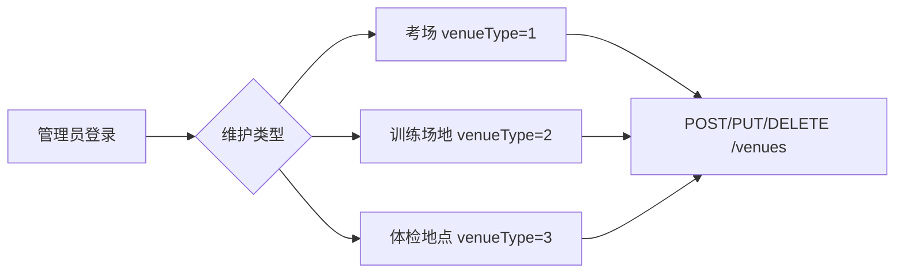
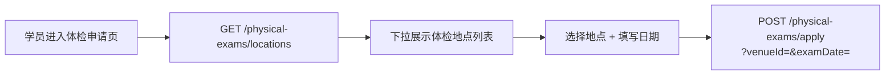

# 场地管理 — 前端接口文档

## 概述

场地管理是对驾校三类场地（**考场**、**训练场地**、**体检地点**）的统一管理模块。管理员通过一套接口维护所有场地信息，学员端在体检申请时从此获取可选地点列表。

### 三种场地类型

| venueType | 类型 | 用途 |
|-----------|------|------|
| 1 | 考场 | 关联考试场次（exam_session.venue_id） |
| 2 | 训练场地 | 训练场地信息管理 |
| 3 | 体检地点 | 学员体检申请时选择的地点来源 |

---

## 通用说明

### 统一响应格式

```json
{
  "state": 20000,
  "message": null,
  "data": { ... }
}
```

| state | 含义 |
|-------|------|
| 20000 | 成功 |
| 40000 | 请求参数错误 |
| 40100 | 未登录或 token 过期 |
| 40300 | 权限不足 |
| 40400 | 资源不存在 |
| 40900 | 数据冲突 |

### 认证方式

所有接口需要在请求头中携带 Token：

```
Authorization: Bearer <token>
```

### 角色说明

| 值 | 角色 | 操作权限 |
|----|------|---------|
| 1 | 学员 | 提交体检申请时使用体检地点列表 |
| 3 | 管理员 | 场地 CRUD 管理 |

---

## 接口列表

### 1. 查询场地列表

按场地类型筛选，不传 venueType 则返回全部。

```
GET /venues
```

**请求参数：**

| 参数名 | 类型 | 必填 | 说明 |
|--------|------|------|------|
| venueType | Integer | 否 | 1-考场, 2-训练场地, 3-体检地点，不传查全部 |

**响应：**

```json
{
  "state": 20000,
  "data": [
    {
      "id": 1,
      "venueType": 1,
      "name": "南岸区车管所",
      "address": "南岸区",
      "contactPhone": "023-12345678",
      "capacity": 100,
      "facilities": "配备空调、候考室",
      "status": 1,
      "createTime": "2026-06-04T10:00:00",
      "updateTime": "2026-06-04T10:00:00"
    }
  ]
}
```

> 仅管理员可调用。

---

### 2. 查询场地详情

```
GET /venues/{id}
```

**响应：** 同列表中的单条数据。

---

### 3. 新增场地

```
POST /venues
Content-Type: application/json
```

**请求参数（JSON Body）：**

```json
{
  "venueType": 1,
  "name": "南岸区车管所",
  "address": "南岸区",
  "contactPhone": "023-12345678",
  "capacity": 100,
  "facilities": "配备空调、候考室",
  "status": 1
}
```

| 字段名 | 类型 | 必填 | 说明 |
|--------|------|------|------|
| venueType | Integer | 是 | 1-考场, 2-训练场地, 3-体检地点 |
| name | String | 是 | 场地名称 |
| address | String | 否 | 详细地址 |
| contactPhone | String | 否 | 联系电话 |
| capacity | Integer | 否 | 容纳人数 |
| facilities | String | 否 | 设施设备说明 |
| status | Integer | 否 | 1-启用（默认）, 0-停用 |

**响应：**

```json
{
  "state": 20000,
  "message": null,
  "data": null
}
```

> 仅管理员可调用。

---

### 4. 修改场地信息

```
PUT /venues/{id}
Content-Type: application/json
```

**请求参数（JSON Body）：**

```json
{
  "name": "南岸区车管所（总所）",
  "capacity": 120,
  "facilities": "配备空调、候考室、饮水机"
}
```

只传需要修改的字段即可。

**响应：**

```json
{
  "state": 20000,
  "message": null,
  "data": null
}
```

> 仅管理员可调用。

---

### 5. 删除场地

```
DELETE /venues/{id}
```

> 逻辑删除，不影响已关联的考试场次、体检申请等历史数据。
> 仅管理员可调用。

---

### 6. 获取可选体检地点（学员端）

学员提交体检申请前调用，获取已启用的体检地点名称列表，用于下拉选择。

```
GET /physical-exams/locations
```

**请求参数：** 无

**响应：**

```json
{
  "state": 20000,
  "data": [
    "南岸区人民医院体检中心",
    "渝中区第一人民医院体检科",
    "江北区中医院体检部"
  ]
}
```

**说明：**
- 学员（role=1）和管理员（role=3）均可调用
- 数据来源：`venue` 表中 `venue_type=3`（体检地点）且 `status=1`（启用）的场地
- 管理员新增/修改体检地点 → 使用 `POST/PUT /venues` 并传入 `venueType=3`
- 管理员停用体检地点 → 使用 `PUT /venues/{id}` 将 `status` 设为 0
- 返回空数组表示未配置任何体检地点

---

### 7. 学员提交体检申请（关联场地）

学员选择体检地点（下拉数据来自接口 6）和日期，提交体检申请。

```
POST /physical-exams/apply
```

**请求参数：**

| 参数名 | 类型 | 必填 | 说明 |
|--------|------|------|------|
| venueId | Integer | 是 | 体检地点 ID（从 GET /physical-exams/locations 获取列表后选择） |
| examDate | String | 是 | 预约体检日期，格式 yyyy-MM-dd |

**说明：**
- `location` 字段由系统根据 `venueId` 自动从 `venue` 表同步名称，前端无需传入
- 同一学员不能同时有多个进行中的申请（待审核或审核通过未完成）
- 上次体检已合格的学员不可再次提交
- 体检日期格式必须为 `yyyy-MM-dd`

**响应：**

```json
{
  "state": 20000,
  "message": null,
  "data": {
    "id": 1,
    "studentId": 4,
    "venueId": 6,
    "location": "南岸区人民医院体检中心",
    "examDate": "2026-06-15",
    "status": 0,
    "remark": null,
    "fileId": null,
    "result": null,
    "createTime": "2026-06-04T10:00:00"
  }
}
```

---

## 前端使用流程

### 管理员维护场地



### 学员选择体检地点



---

## 接口路径速查

| 模块 | 方法 | 路径 | 角色 | 说明 |
|------|------|------|------|------|
| 场地管理 | GET | `/venues?venueType=` | 管理员 | 按类型筛选场地列表 |
| 场地管理 | GET | `/venues/{id}` | 管理员 | 查询场地详情 |
| 场地管理 | POST | `/venues` | 管理员 | 新增场地 |
| 场地管理 | PUT | `/venues/{id}` | 管理员 | 修改场地信息 |
| 场地管理 | DELETE | `/venues/{id}` | 管理员 | 删除场地 |
| 体检地点 | GET | `/physical-exams/locations` | 学员/管理员 | 获取可用体检地点名称列表 |
| 体检申请 | POST | `/physical-exams/apply` | 学员 | 提交体检申请（含 venueId） |

---

## 与旧版的区别

| 对比项 | 旧版（已废弃） | 新版 |
|--------|---------------|------|
| 考场管理 | `/exam-venues` 独立接口 | `/venues?venueType=1` 统一管理 |
| 体检地点管理 | `PUT /physical-exams/locations` 覆盖式更新 | `POST/PUT /venues`（venueType=3） |
| 体检地点数据源 | `config` 表 JSON 字符串 | `venue` 表结构化存储 |
| 体检申请传参 | `location`（字符串） | `venueId`（场地 ID） |
